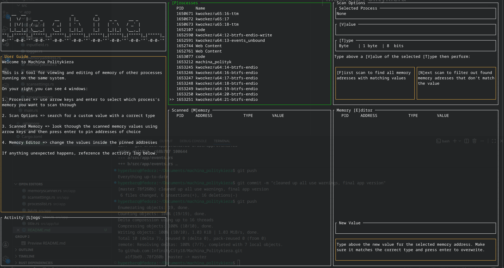

# Machina Politykiera

**Machina Politykiera** is a simple TUI tool for changing other processes' memory on Unix-like based systems written in Rust. Featuring basic functionality like: scanning for value with types: Byte, Word, DWord, QWord, Float, Double and String, setting value under address, pinning addresses and displaying their pointed value.